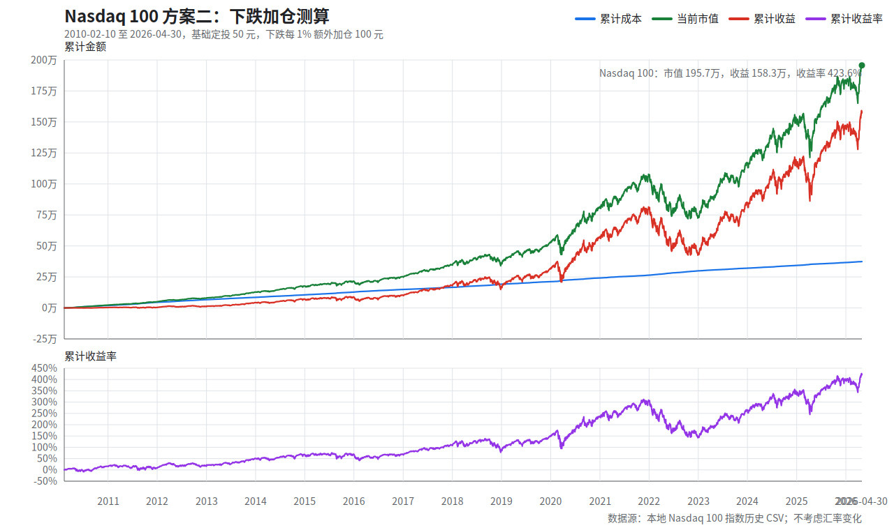

# Nasdaq 100 方案二：下跌加仓测算

版本说明：本文件生成于 2026-04-30。当前可用的最新完整 Nasdaq 100 收盘数据为 2026-04-30，测算截止到 2026-04-30 收盘。

## 1. 汇总表

| 项目 | 数值 |
| --- | ---: |
| 策略规则 | 基础定投 50 元；下跌时额外加仓 = 跌幅百分数 * 100 元 |
| 下跌加仓天数 | 1,801 天 |
| 基础定投合计 | 204,000.00 |
| 额外加仓合计 | 169,704.09 |
| 最大单日额外加仓 | 1,219.33 |
| 最大单日投入 | 1,269.33 |
| 实际开始日期 | 2010-02-10 |
| 截止日期 | 2026-04-30 美股收盘 |
| 投入交易日数 | 4,080 天 |
| 累计成本 | 373,704.09 |
| 累计份额 | 71.9699 |
| 最新收盘价/点位 | 27,186.99 |
| 当前市值 | 1,956,645.71 |
| 累计收益 | 1,582,941.62 |
| 累计收益率 | 423.58% |

## 2. 年度快照

| 年份 | 截止日期 | 当年投入 | 累计成本 | 年末/当前收盘价 | 年末/当前市值 | 累计收益 | 累计收益率 |
| --- | --- | ---: | ---: | ---: | ---: | ---: | ---: |
| 2010 | 2010-12-31 | 19,623.07 | 19,623.07 | 2,225.72 | 22,676.68 | 3,053.61 | 15.56% |
| 2011 | 2011-12-30 | 26,172.01 | 45,795.08 | 2,285.07 | 49,709.75 | 3,914.67 | 8.55% |
| 2012 | 2012-12-31 | 20,919.41 | 66,714.49 | 2,606.36 | 77,421.83 | 10,707.34 | 16.05% |
| 2013 | 2013-12-31 | 18,506.26 | 85,220.74 | 3,570.08 | 128,034.54 | 42,813.80 | 50.24% |
| 2014 | 2014-12-31 | 20,032.96 | 105,253.71 | 4,282.35 | 176,103.61 | 70,849.90 | 67.31% |
| 2015 | 2015-12-31 | 22,402.50 | 127,656.21 | 4,652.01 | 215,009.44 | 87,353.23 | 68.43% |
| 2016 | 2016-12-30 | 21,352.05 | 149,008.26 | 4,918.28 | 250,648.41 | 101,640.16 | 68.21% |
| 2017 | 2017-12-29 | 16,980.24 | 165,988.50 | 6,441.42 | 347,357.25 | 181,368.75 | 109.27% |
| 2018 | 2018-12-31 | 25,379.55 | 191,368.05 | 6,285.27 | 362,169.00 | 170,800.95 | 89.25% |
| 2019 | 2019-12-31 | 20,487.59 | 211,855.64 | 8,709.73 | 525,600.01 | 313,744.37 | 148.09% |
| 2020 | 2020-12-31 | 29,764.13 | 241,619.77 | 12,845.36 | 815,670.18 | 574,050.41 | 237.58% |
| 2021 | 2021-12-31 | 22,479.49 | 264,099.26 | 16,429.10 | 1,069,205.73 | 805,106.47 | 304.85% |
| 2022 | 2022-12-30 | 34,903.40 | 299,002.66 | 10,951.05 | 743,144.27 | 444,141.61 | 148.54% |
| 2023 | 2023-12-29 | 21,548.82 | 320,551.48 | 16,898.47 | 1,173,011.90 | 852,460.42 | 265.94% |
| 2024 | 2024-12-31 | 22,240.80 | 342,792.28 | 21,197.09 | 1,496,334.63 | 1,153,542.35 | 336.51% |
| 2025 | 2025-12-31 | 23,373.56 | 366,165.84 | 25,462.56 | 1,824,845.90 | 1,458,680.06 | 398.37% |
| 2026 | 2026-04-30 | 7,538.25 | 373,704.09 | 27,186.99 | 1,956,645.71 | 1,582,941.62 | 423.58% |

## 3. 图像

## 4. 口径说明

- 不考虑汇率变化：投入金额、成本、市值和收益都按同一货币单位记录，不做美元/人民币转换。
- 不计入分红再投资、股息税、交易佣金、滑点和基金持有税费；仅按 Nasdaq 100 历史收盘价/点位模拟。
- 假设每个有 Nasdaq 100 收盘价/点位的交易日都能以收盘价/点位成交，并允许买入碎股。
- 当日涨跌幅 = 当日收盘价/点位 / 上一交易日收盘价/点位 - 1；首个交易日没有上一交易日，只投入基础定投。
- 当日额外加仓 = max(0, -当日涨跌幅百分数) * 100。例如下跌 1.23%，额外加仓 123.00 元。
- 上涨或持平时，额外加仓为 0，只投入基础定投。
- 历史价格使用本地 `SODHist_19850131-20260430_NDX.csv`，价格为 Nasdaq 100 指数点位；xlsx 已转为 CSV；剔除非正数的未完整收盘行。
- 完整逐日明细见 `Nasdaq100方案二_下跌加仓_2026_04_30.csv`，共 4,080 行。

## 5. 公式

- 当日涨跌幅 = 当日收盘价或点位 / 上一交易日收盘价或点位 - 1
- 当日额外加仓 = max(0, -当日涨跌幅 * 100) * 100
- 当日投入 = 50 + 当日额外加仓
- 当日买入份额 = 当日投入 / 当日收盘价或点位
- 累计份额 = 每日买入份额累计求和
- 累计成本 = 每日投入累计求和
- 当日市值 = 累计份额 * 当日收盘价或点位
- 累计收益 = 当日市值 - 累计成本
- 累计收益率 = 累计收益 / 累计成本

## 6. 生成脚本

- 脚本：`../../scripts/invest_backtest.py`
- 示例运行：`python scripts/invest_backtest.py run --asset nasdaq100 --strategy buy_down`
