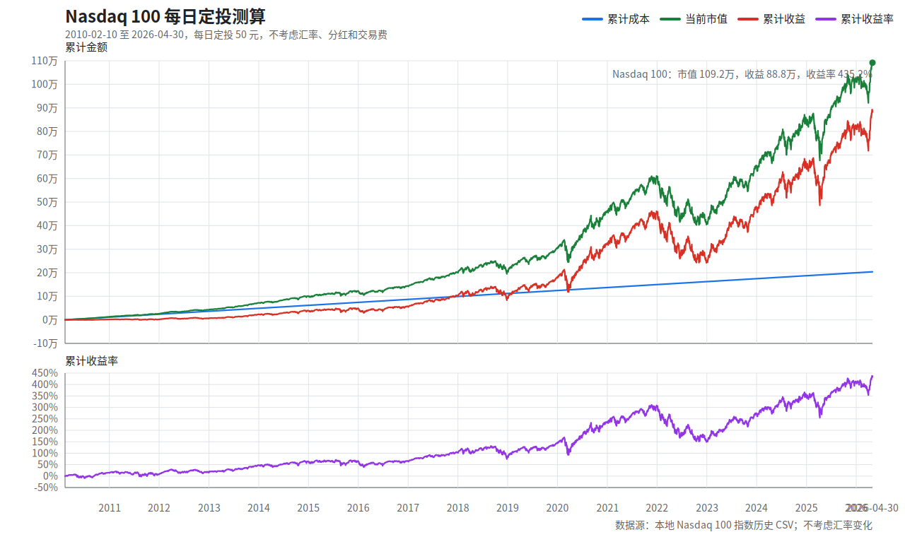

# Nasdaq 100 每日定投测算

版本说明：本文件生成于 2026-04-30。当前可用的最新完整 Nasdaq 100 收盘数据为 2026-04-30，测算截止到 2026-04-30 收盘。

## 1. 汇总表

| 项目 | 数值 |
| --- | ---: |
| 策略规则 | 每个交易日收盘投入 50 元，允许碎股 |
| 实际开始日期 | 2010-02-10 |
| 截止日期 | 2026-04-30 美股收盘 |
| 投入交易日数 | 4,080 天 |
| 累计成本 | 204,000.00 |
| 累计份额 | 40.1612 |
| 最新收盘价/点位 | 27,186.99 |
| 当前市值 | 1,091,862.04 |
| 累计收益 | 887,862.04 |
| 累计收益率 | 435.23% |

## 2. 年度快照

| 年份 | 截止日期 | 当年投入 | 累计成本 | 年末/当前收盘价 | 年末/当前市值 | 累计收益 | 累计收益率 |
| --- | --- | ---: | ---: | ---: | ---: | ---: | ---: |
| 2010 | 2010-12-31 | 11,300.00 | 11,300.00 | 2,225.72 | 12,898.81 | 1,598.81 | 14.15% |
| 2011 | 2011-12-30 | 12,600.00 | 23,900.00 | 2,285.07 | 25,808.91 | 1,908.91 | 7.99% |
| 2012 | 2012-12-31 | 12,500.00 | 36,400.00 | 2,606.36 | 41,800.37 | 5,400.37 | 14.84% |
| 2013 | 2013-12-31 | 12,600.00 | 49,000.00 | 3,570.08 | 72,126.80 | 23,126.80 | 47.20% |
| 2014 | 2014-12-31 | 12,600.00 | 61,600.00 | 4,282.35 | 100,585.27 | 38,985.27 | 63.29% |
| 2015 | 2015-12-31 | 12,600.00 | 74,200.00 | 4,652.01 | 122,497.13 | 48,297.13 | 65.09% |
| 2016 | 2016-12-30 | 12,600.00 | 86,800.00 | 4,918.28 | 143,116.53 | 56,316.53 | 64.88% |
| 2017 | 2017-12-29 | 12,550.00 | 99,350.00 | 6,441.42 | 201,555.48 | 102,205.48 | 102.87% |
| 2018 | 2018-12-31 | 12,550.00 | 111,900.00 | 6,285.27 | 207,985.56 | 96,085.56 | 85.87% |
| 2019 | 2019-12-31 | 12,600.00 | 124,500.00 | 8,709.73 | 302,675.92 | 178,175.92 | 143.11% |
| 2020 | 2020-12-31 | 12,650.00 | 137,150.00 | 12,845.36 | 462,588.46 | 325,438.46 | 237.29% |
| 2021 | 2021-12-31 | 12,600.00 | 149,750.00 | 16,429.10 | 606,035.99 | 456,285.99 | 304.70% |
| 2022 | 2022-12-30 | 12,550.00 | 162,300.00 | 10,951.05 | 414,845.68 | 252,545.68 | 155.60% |
| 2023 | 2023-12-29 | 12,500.00 | 174,800.00 | 16,898.47 | 655,233.48 | 480,433.48 | 274.85% |
| 2024 | 2024-12-31 | 12,600.00 | 187,400.00 | 21,197.09 | 835,978.61 | 648,578.61 | 346.09% |
| 2025 | 2025-12-31 | 12,500.00 | 199,900.00 | 25,462.56 | 1,018,458.14 | 818,558.14 | 409.48% |
| 2026 | 2026-04-30 | 4,100.00 | 204,000.00 | 27,186.99 | 1,091,862.04 | 887,862.04 | 435.23% |

## 3. 图像

## 4. 口径说明

- 不考虑汇率变化：投入金额、成本、市值和收益都按同一货币单位记录，不做美元/人民币转换。
- 不计入分红再投资、股息税、交易佣金、滑点和基金持有税费；仅按 Nasdaq 100 历史收盘价/点位模拟。
- 假设每个有 Nasdaq 100 收盘价/点位的交易日都能以收盘价/点位成交，并允许买入碎股。
- 历史价格使用本地 `SODHist_19850131-20260430_NDX.csv`，价格为 Nasdaq 100 指数点位；xlsx 已转为 CSV；剔除非正数的未完整收盘行。
- 完整逐日明细见 `Nasdaq100每日定投50_2026_04_30.csv`，共 4,080 行。

## 5. 公式

- 当日投入 = 50
- 当日买入份额 = 当日投入 / 当日收盘价或点位
- 累计份额 = 每日买入份额累计求和
- 累计成本 = 每日投入累计求和
- 当日市值 = 累计份额 * 当日收盘价或点位
- 累计收益 = 当日市值 - 累计成本
- 累计收益率 = 累计收益 / 累计成本

## 6. 生成脚本

- 脚本：`../../scripts/invest_backtest.py`
- 示例运行：`python scripts/invest_backtest.py run --asset nasdaq100 --strategy daily`
