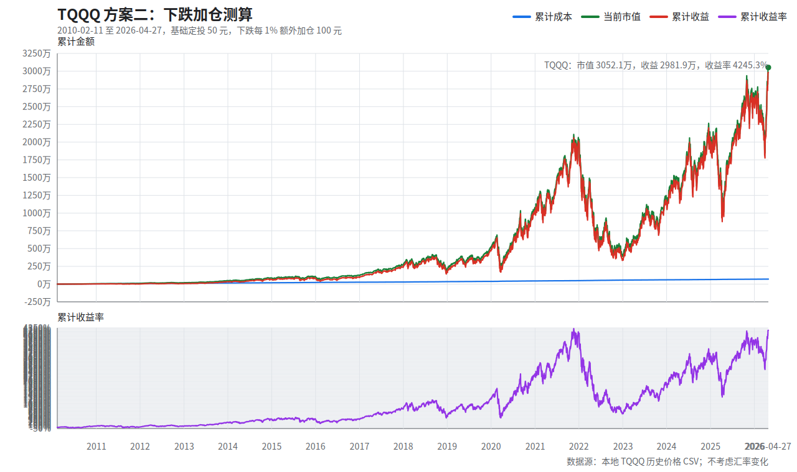

# TQQQ 方案二：下跌加仓测算

版本说明：本文件生成于 2026-04-30。当前可用的最新完整 TQQQ 收盘数据为 2026-04-27，测算截止到 2026-04-27 收盘。

## 1. 汇总表

| 项目 | 数值 |
| --- | ---: |
| 策略规则 | 基础定投 50 元；下跌时额外加仓 = 跌幅百分数 * 100 元 |
| 下跌加仓天数 | 1,587 天 |
| 基础定投合计 | 203,850.00 |
| 额外加仓合计 | 498,541.56 |
| 最大单日额外加仓 | 3,445.85 |
| 最大单日投入 | 3,495.85 |
| 实际开始日期 | 2010-02-11 |
| 截止日期 | 2026-04-27 美股收盘 |
| 投入交易日数 | 4,077 天 |
| 累计成本 | 702,391.56 |
| 累计份额 | 487,247.2317 |
| 最新收盘价/点位 | 62.64 |
| 当前市值 | 30,521,166.59 |
| 累计收益 | 29,818,775.04 |
| 累计收益率 | 4,245.32% |

## 2. 年度快照

| 年份 | 截止日期 | 当年投入 | 累计成本 | 年末/当前收盘价 | 年末/当前市值 | 累计收益 | 累计收益率 |
| --- | --- | ---: | ---: | ---: | ---: | ---: | ---: |
| 2010 | 2010-12-31 | 33,937.75 | 33,937.75 | 0.39 | 52,574.29 | 18,636.53 | 54.91% |
| 2011 | 2011-12-30 | 53,191.85 | 87,129.60 | 0.35 | 97,674.14 | 10,544.54 | 12.10% |
| 2012 | 2012-12-31 | 36,208.47 | 123,338.07 | 0.54 | 187,684.15 | 64,346.08 | 52.17% |
| 2013 | 2013-12-31 | 30,131.51 | 153,469.57 | 1.29 | 500,831.23 | 347,361.65 | 226.34% |
| 2014 | 2014-12-31 | 34,509.63 | 187,979.20 | 2.03 | 835,562.48 | 647,583.28 | 344.50% |
| 2015 | 2015-12-31 | 41,481.10 | 229,460.30 | 2.38 | 1,025,504.36 | 796,044.06 | 346.92% |
| 2016 | 2016-12-30 | 38,413.15 | 267,873.45 | 2.65 | 1,190,700.33 | 922,826.88 | 344.50% |
| 2017 | 2017-12-29 | 25,457.42 | 293,330.88 | 5.78 | 2,631,653.71 | 2,338,322.84 | 797.16% |
| 2018 | 2018-12-31 | 50,734.90 | 344,065.78 | 4.63 | 2,145,181.79 | 1,801,116.01 | 523.48% |
| 2019 | 2019-12-31 | 35,863.46 | 379,929.24 | 10.82 | 5,067,795.52 | 4,687,866.27 | 1,233.88% |
| 2020 | 2020-12-31 | 62,255.67 | 442,184.92 | 22.73 | 10,796,096.19 | 10,353,911.28 | 2,341.53% |
| 2021 | 2021-12-31 | 41,525.41 | 483,710.32 | 41.58 | 19,811,237.16 | 19,327,526.84 | 3,995.68% |
| 2022 | 2022-12-30 | 78,570.68 | 562,281.00 | 8.65 | 4,167,449.81 | 3,605,168.81 | 641.17% |
| 2023 | 2023-12-29 | 39,775.81 | 602,056.81 | 25.35 | 12,279,388.27 | 11,677,331.46 | 1,939.57% |
| 2024 | 2024-12-31 | 41,467.98 | 643,524.79 | 39.56 | 19,214,031.86 | 18,570,507.06 | 2,885.75% |
| 2025 | 2025-12-31 | 45,168.19 | 688,692.98 | 52.72 | 25,672,683.57 | 24,983,990.58 | 3,627.74% |
| 2026 | 2026-04-27 | 13,698.57 | 702,391.56 | 62.64 | 30,521,166.59 | 29,818,775.04 | 4,245.32% |

## 3. 图像

## 4. 口径说明

- 不考虑汇率变化：投入金额、成本、市值和收益都按同一货币单位记录，不做美元/人民币转换。
- 不计入分红再投资、股息税、交易佣金、滑点和基金持有税费；仅按 TQQQ 历史收盘价/点位模拟。
- 假设每个有 TQQQ 收盘价/点位的交易日都能以收盘价/点位成交，并允许买入碎股。
- 当日涨跌幅 = 当日收盘价/点位 / 上一交易日收盘价/点位 - 1；首个交易日没有上一交易日，只投入基础定投。
- 当日额外加仓 = max(0, -当日涨跌幅百分数) * 100。例如下跌 1.23%，额外加仓 123.00 元。
- 上涨或持平时，额外加仓为 0，只投入基础定投。
- 历史价格使用本地 `TQQQ ETF Stock Price History.csv`，价格为拆分调整后的历史可比收盘价口径。
- 完整逐日明细见 `TQQQ方案二_下跌加仓_2026_04_30.csv`，共 4,077 行。

## 5. 公式

- 当日涨跌幅 = 当日收盘价或点位 / 上一交易日收盘价或点位 - 1
- 当日额外加仓 = max(0, -当日涨跌幅 * 100) * 100
- 当日投入 = 50 + 当日额外加仓
- 当日买入份额 = 当日投入 / 当日收盘价或点位
- 累计份额 = 每日买入份额累计求和
- 累计成本 = 每日投入累计求和
- 当日市值 = 累计份额 * 当日收盘价或点位
- 累计收益 = 当日市值 - 累计成本
- 累计收益率 = 累计收益 / 累计成本

## 6. 生成脚本

- 脚本：`../../scripts/invest_backtest.py`
- 示例运行：`python scripts/invest_backtest.py run --asset tqqq --strategy buy_down`
