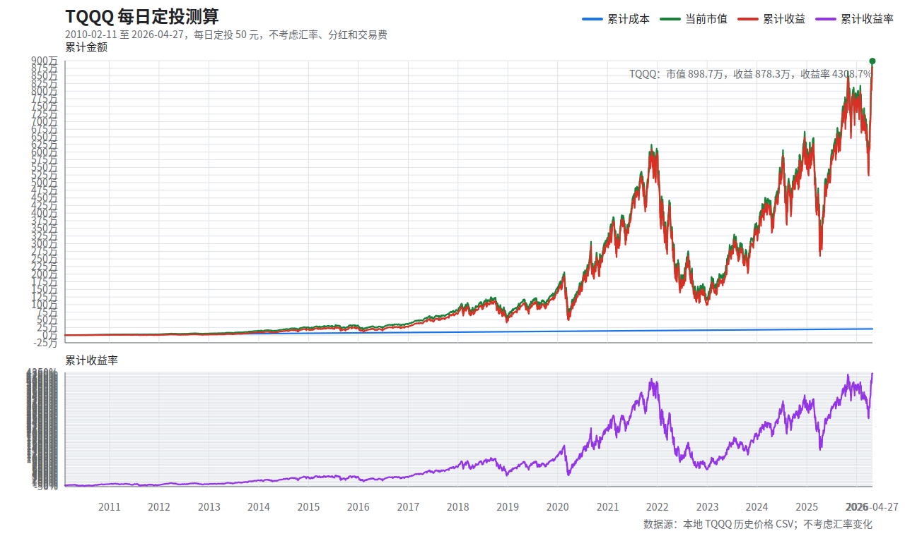

# TQQQ 每日定投测算

版本说明：本文件生成于 2026-04-30。当前可用的最新完整 TQQQ 收盘数据为 2026-04-27，测算截止到 2026-04-27 收盘。

## 1. 汇总表

| 项目 | 数值 |
| --- | ---: |
| 策略规则 | 每个交易日收盘投入 50 元，允许碎股 |
| 实际开始日期 | 2010-02-11 |
| 截止日期 | 2026-04-27 美股收盘 |
| 投入交易日数 | 4,077 天 |
| 累计成本 | 203,850.00 |
| 累计份额 | 143,471.5806 |
| 最新收盘价/点位 | 62.64 |
| 当前市值 | 8,987,059.81 |
| 累计收益 | 8,783,209.81 |
| 累计收益率 | 4,308.66% |

## 2. 年度快照

| 年份 | 截止日期 | 当年投入 | 累计成本 | 年末/当前收盘价 | 年末/当前市值 | 累计收益 | 累计收益率 |
| --- | --- | ---: | ---: | ---: | ---: | ---: | ---: |
| 2010 | 2010-12-31 | 11,250.00 | 11,250.00 | 0.39 | 16,266.19 | 5,016.19 | 44.59% |
| 2011 | 2011-12-30 | 12,600.00 | 23,850.00 | 0.35 | 25,763.54 | 1,913.54 | 8.02% |
| 2012 | 2012-12-31 | 12,500.00 | 36,350.00 | 0.54 | 52,409.87 | 16,059.87 | 44.18% |
| 2013 | 2013-12-31 | 12,600.00 | 48,950.00 | 1.29 | 146,328.55 | 97,378.55 | 198.93% |
| 2014 | 2014-12-31 | 12,600.00 | 61,550.00 | 2.03 | 247,039.62 | 185,489.62 | 301.36% |
| 2015 | 2015-12-31 | 12,600.00 | 74,150.00 | 2.38 | 303,049.98 | 228,899.98 | 308.70% |
| 2016 | 2016-12-30 | 12,600.00 | 86,750.00 | 2.65 | 352,611.64 | 265,861.64 | 306.47% |
| 2017 | 2017-12-29 | 12,550.00 | 99,300.00 | 5.78 | 786,353.84 | 687,053.84 | 691.90% |
| 2018 | 2018-12-31 | 12,550.00 | 111,850.00 | 4.63 | 638,389.20 | 526,539.20 | 470.75% |
| 2019 | 2019-12-31 | 12,600.00 | 124,450.00 | 10.82 | 1,510,207.88 | 1,385,757.88 | 1,113.51% |
| 2020 | 2020-12-31 | 12,650.00 | 137,100.00 | 22.73 | 3,196,763.28 | 3,059,663.28 | 2,231.70% |
| 2021 | 2021-12-31 | 12,600.00 | 149,700.00 | 41.58 | 5,865,636.50 | 5,715,936.50 | 3,818.26% |
| 2022 | 2022-12-30 | 12,550.00 | 162,250.00 | 8.65 | 1,227,499.82 | 1,065,249.82 | 656.55% |
| 2023 | 2023-12-29 | 12,500.00 | 174,750.00 | 25.35 | 3,617,268.44 | 3,442,518.44 | 1,969.97% |
| 2024 | 2024-12-31 | 12,600.00 | 187,350.00 | 39.56 | 5,660,211.61 | 5,472,861.61 | 2,921.20% |
| 2025 | 2025-12-31 | 12,550.00 | 199,900.00 | 52.72 | 7,559,673.38 | 7,359,773.38 | 3,681.73% |
| 2026 | 2026-04-27 | 3,950.00 | 203,850.00 | 62.64 | 8,987,059.81 | 8,783,209.81 | 4,308.66% |

## 3. 图像

## 4. 口径说明

- 不考虑汇率变化：投入金额、成本、市值和收益都按同一货币单位记录，不做美元/人民币转换。
- 不计入分红再投资、股息税、交易佣金、滑点和基金持有税费；仅按 TQQQ 历史收盘价/点位模拟。
- 假设每个有 TQQQ 收盘价/点位的交易日都能以收盘价/点位成交，并允许买入碎股。
- 历史价格使用本地 `TQQQ ETF Stock Price History.csv`，价格为拆分调整后的历史可比收盘价口径。
- 完整逐日明细见 `TQQQ每日定投50_2026_04_30.csv`，共 4,077 行。

## 5. 公式

- 当日投入 = 50
- 当日买入份额 = 当日投入 / 当日收盘价或点位
- 累计份额 = 每日买入份额累计求和
- 累计成本 = 每日投入累计求和
- 当日市值 = 累计份额 * 当日收盘价或点位
- 累计收益 = 当日市值 - 累计成本
- 累计收益率 = 累计收益 / 累计成本

## 6. 生成脚本

- 脚本：`../../scripts/invest_backtest.py`
- 示例运行：`python scripts/invest_backtest.py run --asset tqqq --strategy daily`
